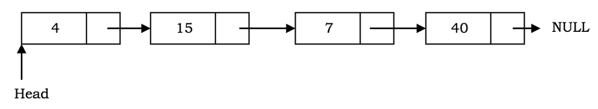

# Singly Linked List

> A linked list is an ordered collection of data elements. A data element can be represented as a node in a linked list. Each node consists of two parts: data & pointer to the next node.


<p style="color: #888888; text-align: center; margin-top: -20px;">Source: <a href="https://codeburst.io/linked-lists-in-javascript-es6-code-part-1-6dd349c3dcc3">codeburst.io</a></p>

#### Implementation

```javascript
```